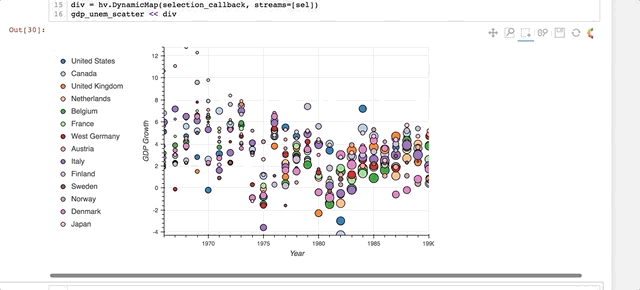

# my little holoviews gallery

In this project I collect some example code snippets that demonstrate various
visualizations that may be useful for cell-based high throughput screening data analysis,
such as plateviewers, scatterplots with links to images etc.

This is also meant for code snippets and animated gifs to illustrate questions on the gitter/bokeh channels or issues in their repositories.

volker dot hilsenstein at embl de

## Gallery

### Plateviewer

Select different 
* plates
* values / features
* colormap
* percentile ranges

Use custom tooltips to link back to source images
from which the features were derived.

### Thumbnails and values in a HTML Div update by selection in scatterplot

### Slice through time/volume series dimensions, adjust colormap and value range

